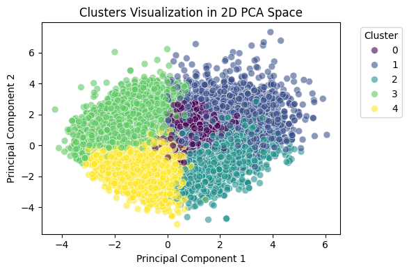

🎵 TunePy – Smart Spotify Music Recommender 🎶
TunePy is a personalized desktop app built using Python that lets users:

Register/login

Select music genres

Get tailored music recommendations

Play songs via Spotify

Enjoy an interactive Tkinter GUI

🚀 Features
🔐 User Registration & Login

🎧 Genre-Based Music Filtering (Pick exactly 5)

🎵 Personalized Song Selection

🤖 Music Recommendation using KMeans clustering on song features

🎼 Direct Playback with Spotify API

🖼️ User-Friendly GUI with visuals and animations (Tkinter + Pillow)

🧠 Tech Stack
Category	Libraries / Tools
UI/UX	Tkinter, Pillow, tkcalendar
ML & Analysis	pandas, scikit-learn
Spotify API	spotipy
Environment	os, dotenv, sys
Data	Spotify's genres_v2.csv dataset

📊 Dataset
The app uses the Spotify genres_v2.csv dataset, which includes features like:

danceability

energy

acousticness

tempo

valence

... and more

Clustering is performed using KMeans on these audio features to recommend songs similar to the user’s choice.
### 🎯 KMeans Clustering Visualization

💡 How It Works
Login/Register

Select 5 Genres

Pick a Favorite Song

App Clusters Songs using KMeans

Recommends Similar Tracks

Play via Spotify!
